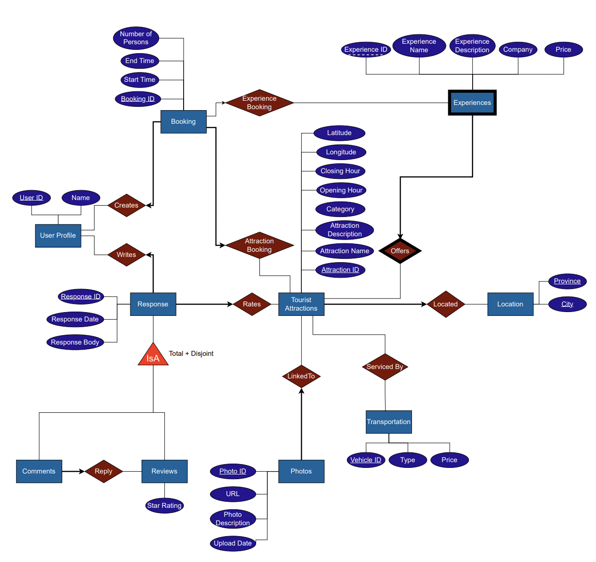

# TouristAttractions: A TripAdvisor Competitor 

## Project Description

Our project resides in the domain of tourism. Specifically, our project focuses on tourist spots present in Canada. The database models all relevant information about a tourist attraction, such as available activities, booking information, photos, and location. This application is applicable for tourists that want to visit areas that best fit their preference criteria (achieved with activity category filtering), and add reviews and comments to help future tourists to make informed decisions.

## Entity-Relationship Diagram

## Supported Operations
- Deletion Operation
- Update Operation
- Projection Operation
- Join Operation
- Aggregation Operations
- Aggregation with "Having" 
- Nested Aggregation

## Tech Stack
- HTML/CSS, formatted with Bootstrap
- JavaScript
- Express.js
- SQL
- Oracle DB